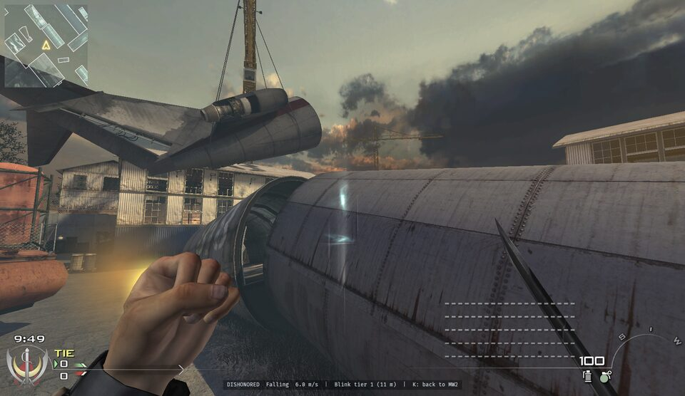
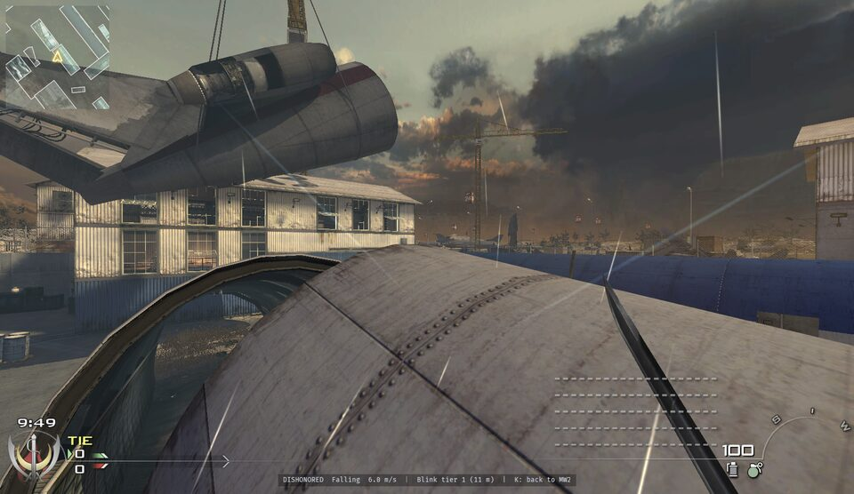

# IW4L + Dishonored

This is a fork of [IW4L](https://github.com/vladtrc/iw4L), vladtrc's open-source
Rust runtime for Call of Duty: Modern Warfare 2 (2009). It adds one thing:
**Dishonored mode**. Press **K** in a match you host and Corvo Attano takes over
your soldier on any MW2 map, with Dishonored's movement, Blink, his arms and
sword, the Blink effects and his sounds. Press K again to get your gun back.

Everything Dishonored comes from your own copy of Dishonored, read when the game
starts. Everything else is upstream IW4L, merged in from vladtrc/iw4L. This fork
is not contributed back upstream; report problems with Dishonored mode here.

<p align="center">
  
  
</p>

## Dishonored mode

- **Movement** from Dishonored itself: walk, sprint, crouch, slide, mantle onto
  ledges up to 2.3 m, lean, swim and ladders. Corvo keeps his own size and speed:
  1.75 m tall, 4 m/s running, a 2.1 m jump.
- **Blink**, both tiers: hold to aim, see the marker where you will land, release
  to go.
- **Corvo's arms and sword** with Dishonored's first-person animations, in place
  of the soldier's weapon.
- **Effects and sounds**: the Blink marker, travel streaks and arrival lens
  effect, slide trails, footstep puffs, splashes, and Dishonored's footsteps
  (by surface), landings, mantles, slides, breathing and Blink sounds.
- **MW2 maps as they are**: Corvo collides with exactly what the soldier does,
  including glass, props and other players.

| | keyboard and mouse | controller |
|---|---|---|
| switch between soldier and Corvo | K, or `dishonored on\|off\|status` in the console | both sticks in |
| move, look, jump, crouch, sprint | your MW2 binds | your MW2 layout |
| Blink: hold to aim, release to go | aim down sights (right mouse) or F | aim trigger |
| Blink tier I / II | 1 / 2 | D-pad down / up |
| lean | Q / E | bumpers |
| slow walk | Alt | |

While Corvo is out, the soldier's firing and weapon changes are off.

### What you need

- **Modern Warfare 2** (PC, the Steam version) with its multiplayer files.
- **Dishonored** (PC). Optional: without it the game runs as plain IW4L and K
  does nothing. It is found in your Steam libraries; for another location, set
  `IW4L_DISHONORED` in `.env` to the folder with `DishonoredGame`.
  `IW4L_DISHONORED_DIFFICULTY=easy|normal|hard|veryhard` picks Corvo's attributes.
- **A match you host.** Like the skate mode it follows, Dishonored mode moves
  your player on your own game's server, so it cannot be used in someone else's
  match.

### Known limitations

- Other players see your soldier glide without leg animation.
- Dishonored's fall damage is not applied to your MW2 health.
- Blink's travel blur is a darkened vignette, not Dishonored's motion blur.

## Build and run

There is no prebuilt release of this fork yet. The Windows zip on
[IW4L's releases](https://github.com/vladtrc/iw4L/releases) is upstream IW4L
without Dishonored mode.

Install Rust through rustup and GNU Make. [Build dependencies](docs/BUILD.md) cover
Linux's C/C++ toolchain and system libraries, and macOS's Xcode command line tools.
[Windows instructions](docs/WINDOWS.md) cover building and arranging a portable folder.

You need your own installed MW2 Multiplayer data. IW4L distributes no game assets
and reads installations without patching or replacing their files. Caches, demos
and logs go under `iw4l-artifacts/`; Linux settings use a separate configuration
directory described in the [run guide](docs/RUN.md).

From the repository root:

```bash
cp .env.example .env
# Edit .env: set IW4L_GAMES to the folder containing your game installations.
make map mp_boneyard CMDS='wait world; spawn 0; force_match_start; bot add 3'
```

This builds the optimized `play` profile and starts a local match with three bots;
press K once you are in. The first build also fetches
[sinhonor](https://github.com/Nacholmo/sinhonor) from GitHub.
`force_match_start` skips the warmup that otherwise freezes movement.

## How the fork is put together

The fork is upstream IW4L plus one commit. The Dishonored side is
[sinhonor](https://github.com/Nacholmo/sinhonor), our own engine-agnostic port of
Dishonored's movement and Blink with readers for its packages, sounds, particles
and animations. IW4L links it as a git dependency pinned to a tag. The IW4L side
hands the local player's movement to sinhonor, sweeps it against the same
collision as MW2's movement, and draws, plays and hides what the mode needs.
[Dishonored mode](docs/DISHONORED.md) lists where each piece lives.

To bring in upstream changes:

```bash
git remote add upstream https://github.com/vladtrc/iw4L   # once
git fetch upstream && git merge upstream/master
```

## About IW4L

IW4L points at a copy of MW2 you already own and loads that installation's maps,
models, textures and weapons into its own engine. You can explore maps, fight bots,
and record and replay demos. Gameplay remains incomplete; expect missing behavior,
bugs and desyncs. The asset readers also cover MW3 and Black Ops.

APIs, configuration, caches and the wire protocol change between commits;
multiplayer peers must run the same build.

| Area | Implementation |
|---|---|
| Assets | Native FastFile readers convert game data into a shared intermediate representation. |
| Shaders | Retail Direct3D 9 Shader Model 3 bytecode is translated to WGSL. |
| Rendering | World geometry, models and effects feed one sorted draw-surface list. |
| Simulation | Server authority, client prediction and replay share one simulation step over explicit Bevy ECS state. |
| Networking | Custom UDP traffic; a QUIC master provides browsing and relaying. The host simulates the match. |

- [Run guide](docs/RUN.md): console commands, classes and demo playback; [master setup](docs/MASTER.md) for playtests.
- [Rendering](docs/RENDER.md) and [simulation](docs/SIM-STEP.md): inspect the engine's implementation.
- [Map loading](docs/MAP-LOAD.md), [GSC runtime](docs/GSC-RUNTIME.md) and [bot AI](docs/BOTS.md): starting points for experiments and modifications.
- [Documentation index](docs/INDEX.md), [contributing](CONTRIBUTING.md) and [security reports](SECURITY.md).

This whole project, the fork included, is written by an LLM.

## Acknowledgements and license

[IW4L](https://github.com/vladtrc/iw4L) is by vladtrc and its contributors; this
fork exists because of their work. Upstream thanks all contributors for code, bug
reports, testing and feedback, and especially **ju1cedr1nker** and **silvernote03**
for QA testing weapons, maps, attachments and other gameplay features.
[2010 Rust Rewrite Mashup](https://github.com/chasmlol/2010-rust-rewrite-mashup)'s
Skate 3 mode showed how another game's movement can drive the IW4L soldier.

[OpenAssetTools](https://github.com/Laupetin/OpenAssetTools) and its [iw4x-x64
fork](https://github.com/iw4x-x64/oat) informed asset layouts;
[IW4x](https://github.com/iw4x/iw4x-client) informed asset and protocol behavior;
[KisakCOD](https://github.com/SwagSoftware/KisakCOD) informed engine structure.
[Ghidra](https://github.com/NationalSecurityAgency/ghidra) was used to inspect the
original binaries. sinhonor's credits are in its own repository.

Movement implementation history and source boundaries are recorded in
[its provenance note](docs/provenance/movement-iw4.md).

IW4L's source, and this fork's, is licensed under [Apache 2.0](LICENSE). sinhonor is
MIT or Apache 2.0. Preserve required attribution and bundled font license texts when
redistributing; see [NOTICE](NOTICE). No Call of Duty or Dishonored game data is in
this repository. Call of Duty and Modern Warfare belong to Activision; Dishonored
belongs to ZeniMax Media and Arkane Studios. This fork is unaffiliated with them and
is not maintained by the IW4L project.
